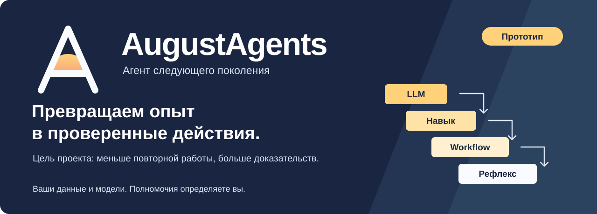
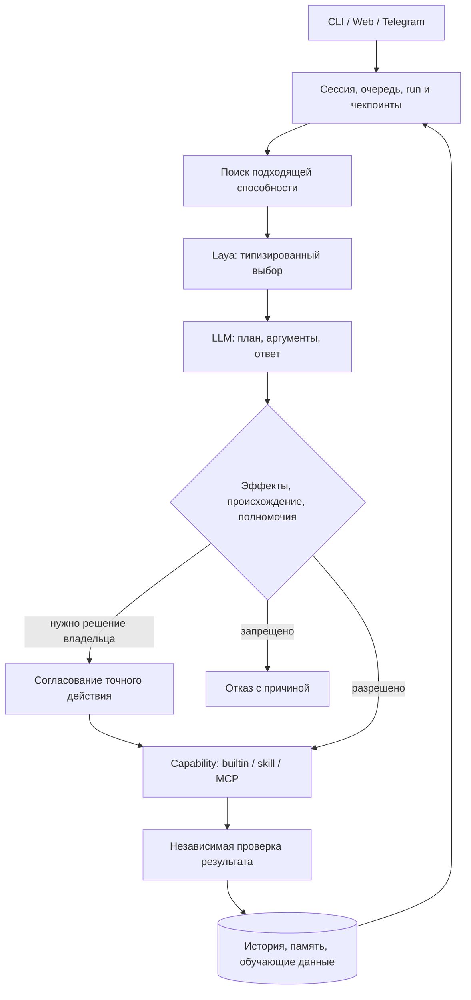

<p align="center">
  
</p>

<p align="center">
  <strong>Локальный агент. Ваши модели. Проверяемый опыт.</strong><br>
  Laya выбирает действие, LLM помогает его сформулировать,<br>
  runtime проверяет полномочия и результат.
</p>

<p align="center">
  <a href="#начать">Начать</a> ·
  <a href="#главная-идея">Главная идея</a> ·
  <a href="#архитектура">Архитектура</a> ·
  <a href="#безопасность">Безопасность</a> ·
  <a href="#полная-цель">Полная цель</a> ·
  <a href="#разработка">Разработка</a>
</p>

<p align="center">
  <a href="LICENSE">MIT</a> · TypeScript / Bun · MCP / SKILL.md · <strong>Прототип</strong>
</p>

AugustAgents — проект персонального агента следующего поколения: он должен
жить рядом с вашими данными, продолжать долгие задачи и превращать повторяющуюся
работу в проверенную автоматизацию. Модель можно заменить; правила доступа,
история действий и доказательства результата должны сохраняться.

**Сейчас это прототип, полная приёмка открыта.** Исходники содержат агентный
цикл, web/CLI/Telegram, MCP и навыки, политики, долговечное состояние, память,
обучение и дистилляцию. Наличие кода не доказывает работу целого продукта.
В проверке от 29 сентября 2026 года чтение файла и продолжение после
перезапуска сначала не прошли. После исправления runtime в `2081216` оба
полезных сценария прошли через веб-чат с реальной локальной Qwen; задержки
остаются большими. Это локальная проверка, полная готовность продукта ещё открыта.
Актуальные результаты и ограничения — в [Verification](docs/agentic/VERIFICATION.md).

## Начать

Для знакомства с текущим прототипом нужен Bun. Сначала изучите
[текущие ограничения](docs/agentic/VERIFICATION.md) и
[контракт безопасности](docs/agentic/SECURITY.md).

```bash
git clone https://github.com/Paffin/AugustAgents.git
cd AugustAgents
bun install --frozen-lockfile
bun packages/app/src/bin.ts setup
bun packages/app/src/bin.ts serve
```

Мастер в исходниках позволяет выбрать модель и OpenAI-совместимый endpoint,
настроить ключ и канал. Адрес веб-чата выводит запущенный шлюз. Для разговора
в терминале вместо `serve` используйте `chat`.

Выбирайте модель под своё оборудование и задачи. Локальные данные не означают,
что запрос к облачному провайдеру остаётся на компьютере: содержимое такого
запроса получает выбранный провайдер.

<details>
<summary>Установщик и границы текущего запуска</summary>

В репозитории есть [install.sh](install.sh): он загружает исходники,
устанавливает зависимости и создаёт команду `august` для macOS/Linux.
Скрипт следует изучить до запуска; используйте отдельное тестовое окружение.

Это ещё не целевой подписанный бинарник, нативная служба и веб-мастер из трёх
действий. Нативный Windows, офлайн-доставка, автоматический выбор локальной
модели, OAuth, импорт из OpenClaw/Hermes и безопасные обновления входят в
[полную дорожную карту](docs/agentic/ROADMAP.md).

Хранилище секретов и его fallback проходят доработку. Проверенная защита ключей
на всех поддерживаемых платформах пока не заявляется.

</details>

## Главная идея

**Опыт должен уменьшать повторную работу и сохранять проверяемость.**
Цель AugustAgents — переводить удачные повторения на следующую ступень:

| Ступень | Как выполняется работа | Что требуется для перехода |
| --- | --- | --- |
| LLM | Модель строит решение для задачи | Подтверждённый результат и пригодная траектория |
| Навык | Версионируемые инструкции помогают повторить задачу | Независимые проверки на отложенных случаях |
| Workflow | Процесс выполняет код, развилки выбирает Laya | Проверка качества, эффектов и условий применения |
| Рефлекс | Подходящая рутина выполняется без генеративного вызова | Измеримый результат и безопасное возвращение на предыдущую ступень |

Самооценка модели и согласие Laya с LLM не являются доказательством успеха.
Ошибка должна понижать ступень; расширение полномочий требует согласования.
Пользователь должен видеть навык, версию, число вызовов модели и причину
перехода. Фактические стоимость, скорость и надёжность нужно измерять на
сопоставимых задачах — опубликованного доказательства экономии пока нет.

## Архитектура

В запущенном веб-чате панель **Secrets** позволяет сохранить или удалить ключ,
в том числе отдельно для capability. Значение отправляется прямо в защищённое
хранилище, не через чат; UI показывает только имена и очищает password-поле при
отправке и закрытии панели. Plaintext-backend не допускается. Изменённые ключи
уже запущенных провайдеров/MCP могут потребовать перезапуска.

Это управление секретами после настройки агента, не готовый веб-мастер первого
запуска. Изоляция namespace системного keychain между установками ещё не завершена;
для OS-backend интерфейс показывает предупреждение.

Панель **Tasks** показывает последние задачи этой веб-сессии: состояние, шаги,
реальные reported tokens и расход по настроенной оценке. Можно запросить паузу,
отменить дальнейшую работу или продолжить безопасный checkpoint после перезапуска.
Остановка кооперативная: она не отменяет уже начатый внешний вызов и не откатывает
его эффект. Неоднозначный `tool_started` checkpoint продолжить нельзя.

Оценка ответа привязана к его точному `feedbackId` (сегменту траектории), а не
к последнему состоянию run-id. В Tasks можно оценить завершённый ответ после
продолжения; уже сохранённая оценка видна и переживает перезапуск. CLI-команда
`august learn feedback FEEDBACK_ID good|bad` также принимает точный сегмент.

Web-пульт разделён на Chat, Tasks и Secrets; адаптируется к телефону, поддерживает
многострочный ввод (Enter — отправить, Shift + Enter — перенос строки) и проверяет
доступность runtime с авторизацией. В терминальном чате доступны `/help`, `/tasks`,
`/resume ID` и `/exit`, после задачи выводятся состояние и учтённый расход.
Telegram поддерживает `/help` и `/tasks` с кнопками паузы, продолжения и отмены
дальнейшей работы, привязанными к сессии владельца. Новые TG-сценарии пока проверены
регрессиями транспорта, не живым ботом. Это первый UX-инкремент: полноценный TUI,
онбординг и остальные страницы центра управления ещё не завершены.
У одной базы теперь может быть только один активный runtime: второй CLI/gateway
получит понятный отказ, не меняя состояние задач первого. CLI пока не умеет
подключаться как клиент к уже работающему gateway — этот сценарий ещё открыт.

Двухслойный мозг решает разные задачи: Laya отвечает на типизированные вопросы,
генеративная модель планирует, пишет текст и заполняет аргументы. Политика
исполнения действует независимо от решения любой модели.



Схема показывает целевой поток. Есть Laya-sidecar и нативный CPU ONNX-backend
без Python: реальные веса проверены в полезной веб-задаче в теневом режиме.
Активация по экзамену и полный цикл локального дообучения ещё не готовы.
В рабочем режиме следует учитывать выбранный
backend, калибровку и fallback, а не считать Laya активной по наличию адаптера.

Для нативного backend в `laya.onnx` задаются абсолютная `directory` и `sha256`
для `model`, `tokenizer`, `tokenizerConfig`, `modelConfig`. В каталоге ожидаются
`model.onnx`, `tokenizer.json`, `tokenizer_config.json`, `rl_agent_config.json`.
Контрольные суммы берите из доверенного закреплённого checkpoint; runtime не
скачивает веса и не подменяет выбранную модель. `laya.url` одновременно не задаётся.
Теневой режим включён по умолчанию; `august doctor` проверяет и загружает граф,
`august laya status` показывает экзамен именно текущей версии весов.

`bun run build` собирает бинарник текущей платформы с CPU-библиотекой ONNX.
Нативный backend проверен на macOS arm64; другие платформы, подпись и выпуск
ещё требуют приёмки.

Подробности и границы текущей реализации:
[Architecture](docs/agentic/ARCHITECTURE.md) ·
[Domain](docs/agentic/DOMAIN.md) ·
[Product](docs/agentic/PRODUCT.md).

## Безопасность

Устанавливаемая способность, её издатель и возвращённый ею текст имеют разные
границы доверия. Найденный в реестре пакет не становится доверенным автоматически.

| Контракт | Что он должен обеспечивать |
| --- | --- |
| Эффекты и мандаты | Действие ограничено адресатом, данными, сроком, правами и бюджетом |
| Происхождение данных | Письмо, страница и вывод инструмента не приобретают полномочия владельца |
| Точное согласование | Разрешение относится к конкретному действию; просроченное или чужое не подходит |
| Capability lifecycle | Источник, версия, хеш, права, проверка, установка и откат прослеживаются |
| Изоляция и секреты | Чужой код получает ограниченные ресурсы; ключи выдаются только в разрешённом контексте |
| Состояние и журнал | Перезапуск, повторный запрос и повреждение истории имеют проверяемый исход |

Это требования проекта. В исходниках есть политики и проверки инъекций;
они не устанавливают полную защищённость runtime или платформенную изоляцию.
Пропущенная проверка не считается пройденной. Полный контракт и открытые границы
описаны в [Security](docs/agentic/SECURITY.md).

## Полная цель

Установка в три действия — начало пути: запустить установщик, выбрать мозг,
подключить канал. Далее агент должен работать постоянно, расти по проверенным
исходам и оставаться управляемым. Вся цель сохраняется в
[Blueprint](docs/agentic/PROJECT-BLUEPRINT.md), а порядок и зависимости — в
[Roadmap](docs/agentic/ROADMAP.md). Все направления ниже требуют полной приёмки.

| Направление | Целевой результат |
| --- | --- |
| Надёжное ядро | Долговечные сессии, очереди, checkpoint/recovery, ограничение шагов и денег |
| Доступный запуск | Подписанный бинарник, нативные службы, определение оборудования, proxy/зеркала/офлайн, doctor и сохранение данных при удалении |
| Мозг и рост | Нативная Laya, предобученный agent-decisions checkpoint, экзамены моделей, fallback, локальное обучение, дистилляция и видимая статистика |
| Способности | Локальные каталоги и зеркала, поиск и recall, подписи и лицензии, MCP/SKILL.md/плагины, scoped OAuth, дедупликация, написание недостающего MCP |
| Память и управление | Источники и даты, поиск, редактируемая модель пользователя, web control center, inbox разрешений, журнал и бюджеты |
| Миссии и внимание | Цели на недели, вехи, управление во время работы, супервизор процессов, расписания, heartbeat, IANA-зоны, тихие часы и дайджесты |
| Каналы и действия | CLI/web/Telegram, Slack/Discord/e-mail/WhatsApp Business/Matrix, браузер, ограниченные воркеры, голос и вложения |
| Предпросмотр и перенос | Спекулятивный прогон, diff, снимки, отмена; импорт OpenClaw/Hermes, шифрованный бэкап и восстановление на другом хосте |
| Эксплуатация | Подписанные A/B-обновления, репетиция миграций, откат, OpenTelemetry и объяснение решений |
| Сеть и совместная работа | Подписанная A2A-идентичность, платёжные мандаты, CRDT и устройства, роли и общие навыки, VPS/serverless и гибернация |
| Коллективный иммунитет | Добровольный обмен репутацией и хешами угроз, федеративное обучение и измеримый бюджет приватности |

Готовность определяется доказательствами результата каждого направления.
Успех первой задачи или базового релиза не сокращает эту цель.

## Разработка

В основе — TypeScript/Bun workspace. Границы пакетов видны в репозитории:

```text
packages/
  app/            CLI, конфигурация и сборка runtime
  gateway/        web-шлюз
  channels/       адаптеры каналов
  core/           состояние, очереди и выполнение
  agent/          агентный цикл
  brain/          решения и генеративные модели
  policy/         эффекты, происхождение и полномочия
  capabilities/   способности и исполнение
  discovery/      поиск и установка
  mcp/            протокольный адаптер
  memory/         память и происхождение
  learning/       проверенные исходы и калибровка
  ladder/         ступени дистилляции
sidecar/          Python-адаптер Laya
```

```bash
bun install --frozen-lockfile
bun run typecheck
```

Команды полного набора — `bun test` и `bun run check`. Перед запуском прочитайте
[Verification](docs/agentic/VERIFICATION.md): в baseline от 29 сентября выявлены
credential-тесты, использовавшие системное хранилище хоста. Они изолированы
в `6c4a2d5`; текущий полный набор проходит, а платформенные пропуски остаются открытыми.

Любое изменение сверяется с [AGENTS.md](AGENTS.md), согласованной целью
и проверенными результатами. Модели, цены и пороги должны определяться конфигурацией
владельца и проверенными данными; ответы задач и исключения маршрутизации нельзя
подменять хардкодом. Для поведения сохраняются регрессионные и атакующие
проверки; приёмку подтверждают полезные сценарии через живой интерфейс,
с настоящей моделью и проверкой фактического результата, включая отказ,
перезапуск и восстановление там, где это относится к сценарию.

## Документация и ориентиры

| Задача читателя | Документ |
| --- | --- |
| Понять полную цель и требования | [Project Blueprint](docs/agentic/PROJECT-BLUEPRINT.md) |
| Найти следующий этап и зависимости | [Roadmap](docs/agentic/ROADMAP.md) |
| Проверить факты о готовности | [Verification](docs/agentic/VERIFICATION.md) |
| Изучить границы доверия | [Security](docs/agentic/SECURITY.md) |
| Найти владельца документа и действующий контракт | [Wayfinding](docs/agentic/WAYFINDING.md) |

Для класса продукта ориентируемся на
[OpenClaw](https://github.com/openclaw/openclaw) и
[Hermes Agent](https://github.com/NousResearch/hermes-agent): персональный агент,
каналы, расширяемость и накопление опыта. Цель AugustAgents — проверяемая
дистилляция под независимой политикой исполнения. Превосходство по качеству,
цене или безопасности должно подтверждаться сопоставимыми измерениями.

[MIT License](LICENSE). OpenClaw и Hermes Agent — самостоятельные проекты;
AugustAgents не заявляет аффилиацию с ними.
