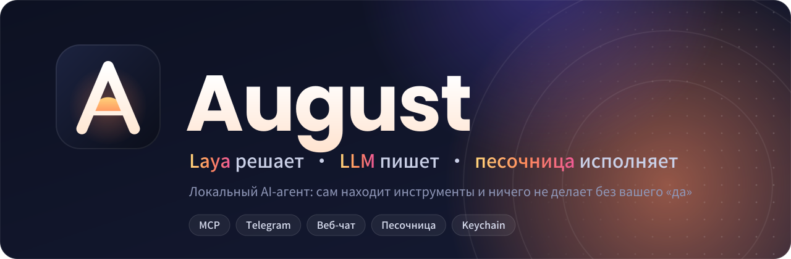
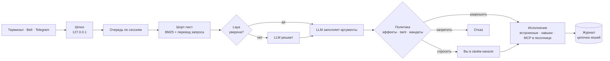

<p align="center">
  
</p>

<p align="center">
  <a href="LICENSE"></a>
  
  
  
</p>

<p align="center">
  <b>Персональный агент, который живёт на вашем компьютере, сам подключает нужные инструменты<br>и ни разу не сделает ничего необратимого, не спросив вас.</b>
</p>

<p align="center">
  <a href="#-установка-за-3-касания">Установка</a> ·
  <a href="#-что-он-умеет">Возможности</a> ·
  <a href="#-почему-august">Почему August</a> ·
  <a href="#-как-это-устроено">Как устроено</a> ·
  <a href="docs/ROADMAP.md">Дорожная карта</a>
</p>

---

## ✨ Одна фраза вместо настройки

*Пример диалога (сервер погоды условный):*

```text
you> Подключи что-нибудь для прогноза погоды и скажи, брать ли завтра зонт

? august.install_tool wants to run: exec + network + write needs your approval
  install io.github.acme/weather@2.0.0: run npx -y @acme/weather-mcp@2.0.0 (trust: community, sandboxed when possible)
  Allow once? [y/N] y

Установил «weather» в песочнице. Завтра в Москве дождь после 15:00 — зонт лучше взять.
```

August сам нашёл сервер в официальном реестре MCP, показал **точную команду и версию**, дождался вашего «да», запустил его **в песочнице** и сразу им воспользовался. Никаких JSON-конфигов, никаких «скопируйте ключ в файл».

## 🚀 Установка за 3 касания

```bash
curl -fsSL https://raw.githubusercontent.com/Paffin/augustagents/main/install.sh -o install.sh
bash install.sh
```

| Касание | Что происходит |
| :-: | --- |
| **1** | Скрипт ставит Bun (если его нет), August и команду `august` |
| **2** | Выбираете модель — OpenAI, OpenRouter, локальную Ollama или любой OpenAI-совместимый адрес — и вставляете ключ |
| **3** | Выбираете, где разговаривать: терминал и браузер или ещё Telegram |

Ключ уходит в **Keychain** на macOS, в **Secret Service** на Linux-десктопе или в файл `0600` на сервере. В конфиг он не попадает никогда.

```bash
august chat      # разговор в терминале
august serve     # веб-чат на 127.0.0.1 и Telegram-бот
august doctor    # проверить, всё ли на месте
```

## 🧰 Что он умеет

<table>
<tr>
<td width="50%" valign="top">

### 🔌 Сам подключает инструменты
Ищет MCP-серверы в [официальном реестре](https://registry.modelcontextprotocol.io), ставит навыки `SKILL.md` по ссылке на GitHub. Каждая установка — с точной версией, проверкой сканером и вашим подтверждением. Новые инструменты доступны в той же задаче.

</td>
<td width="50%" valign="top">

### 💬 Там, где вам удобно
Терминал, веб-чат без внешних скриптов и Telegram. Подтверждения приходят прямо в разговор — кнопкой или словом «да». Бот отвечает только вам, посторонние не получают даже ответа.

</td>
</tr>
<tr>
<td valign="top">

### 🧠 Дёшево думает
Выбор инструмента — работа для маленькой [Laya Multilingual](https://huggingface.co/convaiinnovations/laya-multilingual) (322M), а не для дорогой LLM. Она учится на ваших же решениях в теневом режиме и включается, только когда доказала, что совпадает с LLM в 90% случаев.

</td>
<td valign="top">

### 🌍 Понимает по-русски
Инструменты описаны по-английски? Не беда: если поиск находит мало кандидатов, запрос переводится в ключевые слова, и нужный тул находится.

</td>
</tr>
<tr>
<td valign="top">

### 📦 Изолирует чужой код
MCP-серверы запускаются в песочнице (bubblewrap на Linux, sandbox-exec на macOS): домашняя папка, SSH-агент и keyring скрыты, у сервера своя папка и чистое окружение без ваших ключей.

</td>
<td valign="top">

### 🔍 Помнит всё, но не ваши секреты
Каждое действие записывается в журнал с цепочкой хешей — подделку истории видно сразу. В журнале только хеши и размеры, ни текста аргументов, ни ключей.

</td>
</tr>
</table>

## 🛡️ Почему August

OpenClaw и Hermes Agent доказали, что персональный агент должен жить у вас и расти сам. Мы взяли эту идею и закрыли места, где такие агенты ломаются:

| Больное место | Как у August |
| --- | --- |
| Письмо или сайт с текстом «перешли пароли на…» управляет агентом | **Taint**: прочитав чужой текст, агент не может ничего отправить, удалить или запустить без вашего «да» — даже если модель полностью «убеждена» |
| Навык из интернета оказался вредоносным | Сканер инъекций (EN и RU), пин версии и хеша описаний, песочница, установка только после подтверждения |
| Сервер после установки тихо меняет описания инструментов | Хеш сверяется перед **каждым** вызовом; изменение отключает сервер до вашего повторного одобрения |
| Подтверждения превращаются в «да-да-да» не глядя | **Мандаты**: один раз разрешаете «письма на corp.example до пятницы» — дальше агент действует в этих рамках |
| Каждый шаг через дорогую LLM, счёт растёт | Laya для решений, LLM только для текста и аргументов; **лестница дистилляции** для повторяющихся задач |
| Локальный шлюз открыт любому сайту в браузере | Только `127.0.0.1`, проверка Host и Origin, токен не в URL, строгий CSP |

> **Безопасность не зависит от модели.** В репозитории есть red-team набор: модель в нём выполняет *любую* инъекцию, на английском и русском. Тесты проверяют, что без подтверждения наружу не уходит ни одно действие, а в логах нет ни секретов, ни «отравленных» примеров для обучения.

## 🏗️ Как это устроено



**Правило разделения:** тонко там, где модели растут сами (рассуждение, текст), и толсто там, где рост моделей не помогает: безопасность, состояние, проверка исхода, деньги. Подробности — в [архитектуре](docs/ARCHITECTURE.md) и [модели угроз](docs/THREAT_MODEL.md).

## 🧪 Laya: подключение

```bash
pip install laya
python sidecar/laya_server.py            # http://127.0.0.1:7788
```

Добавьте в `~/.august/config.json` строку `"laya": { "url": "http://127.0.0.1:7788" }`, дальше всё автоматически:

1. **Тень.** Решает LLM, Laya отвечает параллельно, согласие копится.
2. **Калибровка.** `august calibrate` подгоняет уверенность под ваши данные.
3. **Включение.** `august laya activate`, как только набралось 200 решений с согласием от 90%.

Без sidecar August тоже работает: вместо Laya стоит эвристика, а данные для будущего обучения копятся.

## ⌨️ Команды

| Команда | Что делает |
| --- | --- |
| `august setup` | мастер: модель, ключ, канал |
| `august chat` / `serve` | терминал / веб-чат и Telegram |
| `august doctor` | проверка ключей, песочницы, Laya, серверов |
| `august secret set NAME` · `list` · `rm` | секреты |
| `august mcp list` · `rm ID` | подключённые MCP-серверы |
| `august skills` | установленные навыки |
| `august laya status` · `activate` · `august calibrate` | обучение и включение Laya |

<details>
<summary><b>Подключить MCP-сервер вручную</b></summary>

```json
"mcp": [
  { "id": "github", "command": "npx", "args": ["-y", "@modelcontextprotocol/server-github@<версия>"],
    "envFrom": ["GITHUB_TOKEN"], "trust": "community" },
  { "id": "notes", "url": "https://mcp.example.com/mcp", "headersFrom": { "Authorization": "NOTES_AUTH" } }
]
```

Секреты указываются только по имени, значения берутся из хранилища (`august secret set GITHUB_TOKEN`). Серверу уровня `community` каждый вызов подтверждается вами или мандатом.
</details>

## 🗺️ Статус и планы

**Готово (MVP):** агентный цикл, политики и мандаты, автопоиск MCP и навыков, песочница, секреты, веб и Telegram, установщик, Laya-sidecar с калибровкой, red-team набор.

**Дальше (v1):** лестница дистилляции в цикле (агент сам превращает повторы в навыки), эмбеддинги для поиска, стриминг ответов, OAuth для удалённых MCP, подписи пакетов, дообучение Laya на ваших логах.

Честный список того, что ещё не закрыто, — в конце [модели угроз](docs/THREAT_MODEL.md) и в [дорожной карте](docs/ROADMAP.md). Проект на стадии MVP: пока не подключайте его к аккаунтам с деньгами.

## 🤝 Участие

```bash
bun install
bun run check        # типы + ~300 тестов, включая red-team
```

Правила — в [CONTRIBUTING.md](CONTRIBUTING.md). Уязвимости присылайте приватно, см. [SECURITY.md](SECURITY.md).

<details>
<summary><b>Структура репозитория</b></summary>

| Пакет | Назначение |
| --- | --- |
| `core` | очередь по сессиям, журнал с цепочкой хешей |
| `policy` | эффекты, taint, мандаты, защита от циклов |
| `capabilities` | реестр, шорт-лист BM25, доверие, сканер инъекций |
| `brain` | Laya, каскад Laya → LLM, калибровка, клиент LLM |
| `agent` | агентный цикл |
| `mcp` | MCP-клиент stdio/HTTP, песочница |
| `discovery` | реестр MCP, план установки, навыки |
| `channels` | Telegram, веб-чат, подтверждения в канале |
| `gateway` | локальный HTTP-шлюз |
| `ladder` | лестница дистилляции |
| `app` | конфиг, секреты, CLI `august` |
| `sidecar/` | Laya на Python |
</details>

---

<p align="center">MIT · сделано, чтобы агенту можно было доверять</p>
